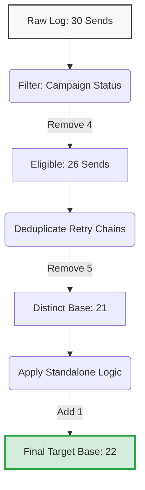

# Comm-Log Send Reconciliation

## Xeno Data Analyst Internship — Take-Home Assignment

### Objective
Reproduce Finance's reported `target_base` of **22** for:
- **Merchant:** 501
- **Period:** October 2026
- **Communication type:** Campaign (`communication_type = '2'`)

The investigation starts from the raw `communication_log` data and reconciles the naive send count to the Finance-reported metric by applying the campaign eligibility, retry-chain, and standalone-campaign reporting rules.

## Final Result & Reconciliation Bridge

**Finance target:** `22` | **Reconciled target_base:** `22` ✅

| Step | Investigation / Adjustment | Result | Change | Reason |
|---:|---|---:|---:|---|
| 0 | Naive count of all October Campaign send attempts | 30 | — | Counts every matching `communication_log` row. |
| 1 | Exclude ineligible campaign sends | 26 | -4 | Campaign `9004` is `approval_awaiting`, so its four send rows are excluded from Finance reporting. |
| 2 | Diagnostic distinct-customer checkpoint | 21 | -5 | Retry-chain customers are deduplicated across the underlying communication, while this checkpoint applies distinct-customer counting to each reporting root. |
| 3 | Apply standalone-campaign event counting | **22** | +1 | Campaign `9101` is standalone, so all seven send events count. `C20` appears twice and both events qualify. |

*For a comprehensive step-by-step breakdown of the SQL logic, retry chains, and validation checks, please see the full analysis in [`analysis/reconciliation_bridge.md`](analysis/reconciliation_bridge.md).*

### Reconciliation Data Flow


## Notable Data Observation
One detail that stood out was that communication-log rows can already exist for a campaign whose creation workflow is still `approval_awaiting`. This means the presence of a send event alone is not sufficient to determine reporting eligibility. I also found that repeated customers do not have one universal treatment: repeated customers across a retry chain are counted once, while repeated send events within a standalone campaign remain separate qualifying events. This distinction was essential to reconciling the reported number of **22**.

## Repository Structure & How to Run

### SQL Execution
The raw data is provided in `data/comm_log.db`. You can verify the final reconciliation directly against this SQLite database by running:

```bash
sqlite3 data/comm_log.db < sql/09_final_reconciliation.sql